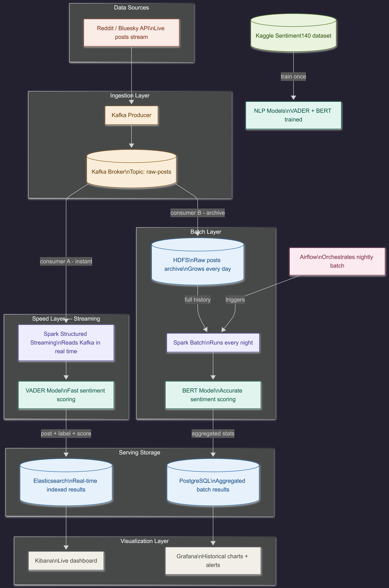

# 🌐 Social Sentiment Analysis — Big Data Streaming Pipeline

A real-time and historical sentiment analysis platform built on a **Lambda-style architecture**. The system streams live posts from Bluesky, processes them through a distributed pipeline, stores them in HDFS, and performs real-time analytics using Apache Spark Structured Streaming.

---

# 🚀 Overview

This project ingests a continuous stream of Bluesky posts, applies sentiment analysis (positive / negative / neutral), and stores results for two types of processing:

- ⚡ **Real-time analytics** → live sentiment tracking (seconds-level updates)
- 📊 **Historical analytics** → batch analysis of trends over time

It demonstrates a full end-to-end **Big Data streaming architecture**.

---

# 🧱 System Architecture

## High-level pipeline

```
Bluesky Stream
   ↓
WebSocket Bridge (Python)
   ↓
TCP Socket (port 9999)
   ↓
HDFS Collector (buffering + batching)
   ↓
HDFS Data Lake (partitioned storage)
   ↓
Apache Spark Structured Streaming
   ↓
Real-time analytics output
```

---

## Architecture Diagram



---

# 📦 Components

## 🔵 1. Bluesky Bridge (`bridge.py`)
- Connects to Bluesky Jetstream WebSocket
- Filters `app.bsky.feed.post` events
- Extracts post text
- Streams JSON messages via TCP socket (port 9999)

---

## 🟡 2. HDFS Collector (`hdfs_collector.py`)
- Connects to bridge via TCP
- Buffers incoming posts
- Writes JSONL files to HDFS using WebHDFS API
- Organizes data by time partitions:

```
/bluesky/raw/YYYY-MM-DD/HH/
```

---

## 🟢 3. Hadoop Cluster (HDFS)
- NameNode + DataNodes
- Stores raw streaming data
- Web UI available at:
  - http://localhost:9870

---

## 🟣 4. Apache Spark Streaming
- Reads new files from HDFS
- Uses Structured Streaming API
- Performs real-time aggregation
- Outputs results to console

---

# ⚙️ Tech Stack

- Python 3.11
- Docker & Docker Compose
- Apache Hadoop (HDFS)
- Apache Spark 3.5 (official image)
- WebSockets
- TCP Sockets
- WebHDFS REST API

---

# 📁 Project Structure

```
Social-Media-Sentiment-Analysis
├── bridge/
│   ├── Dockerfile
│   └── bridge.py
├── collector/
│   ├── Dockerfile
│   └── hdfs_collector.py
├── spark/
│   ├── Dockerfile
│   └── stream.py
├── hadoop-config/
│   ├── core-site.xml
│   └── hdfs-site.xml
├── docker-compose.yml
├── hadoop.env
└── README.md
```

---

# 🚀 How to Run

## 1. Clone repository

```bash
git clone <repo-url>
cd Social-Media-Sentiment-Analysis
```

---

## 2. Start full system

```bash
docker compose up --build
```

---

# 🌐 Access Interfaces

| Service        | URL |
|----------------|-----|
| HDFS NameNode  | http://localhost:9870 |
| Spark UI       | http://localhost:8080 |

---

# 📊 Expected Output

## 📦 HDFS Storage

Files stored in:

```
/bluesky/raw/YYYY-MM-DD/HH/posts_*.jsonl
```

Example content:

```json
{"text": "hello world"}
{"text": "iphone event live"}
```

---

## ⚡ Spark Streaming Output

Example console output:

```
-------------------------------------------
Batch: 0
-------------------------------------------
+--------------------+-----+
|text                |count|
+--------------------+-----+
|apple event         |12   |
|iphone leak         |7    |
+--------------------+-----+
```

---

# 🔄 Data Flow Summary

1. Bluesky streams live posts
2. Bridge forwards data via TCP
3. Collector buffers and batches data
4. Data is stored in HDFS (JSONL format)
5. Spark reads new files automatically
6. Real-time aggregation is computed

---

# 🧠 Key Features

- Real-time ingestion pipeline
- Distributed storage (HDFS)
- Streaming analytics (Spark)
- Fault-tolerant buffering system
- Time-based partitioning
- Fully containerized microservices architecture

---

# 🧪 Testing the System

## Check bridge logs

```bash
docker logs -f bluesky-bridge
```

---

## Check collector logs

```bash
docker logs -f hdfs-collector
```

---

## Check HDFS

http://localhost:9870

---

## Check Spark logs

```bash
docker logs -f spark-app
```

---

# 🛠️ Common Issues

## ❌ Bridge not reachable
- Ensure `BRIDGE_HOST=bluesky-bridge`
- Ensure port `9999` is exposed

---

## ❌ Spark crashes at startup
- Missing schema in `stream.py`
- Incorrect HDFS configuration

---

## ❌ No Spark output
- Spark only reads files created after it starts

---

# 📈 Future Improvements

- Replace TCP bridge with Kafka (production-grade streaming)
- Add sentiment analysis (NLP models)
- Build real-time dashboard (Streamlit / React)
- Convert JSONL → Parquet format
- Add windowed analytics (5–10 min trends)

---

# 👨‍💻 Author

This project demonstrates core Big Data concepts:

- Streaming data ingestion
- Distributed storage systems
- Real-time processing engines
- Containerized microservices architecture

---

# 📜 License

MIT