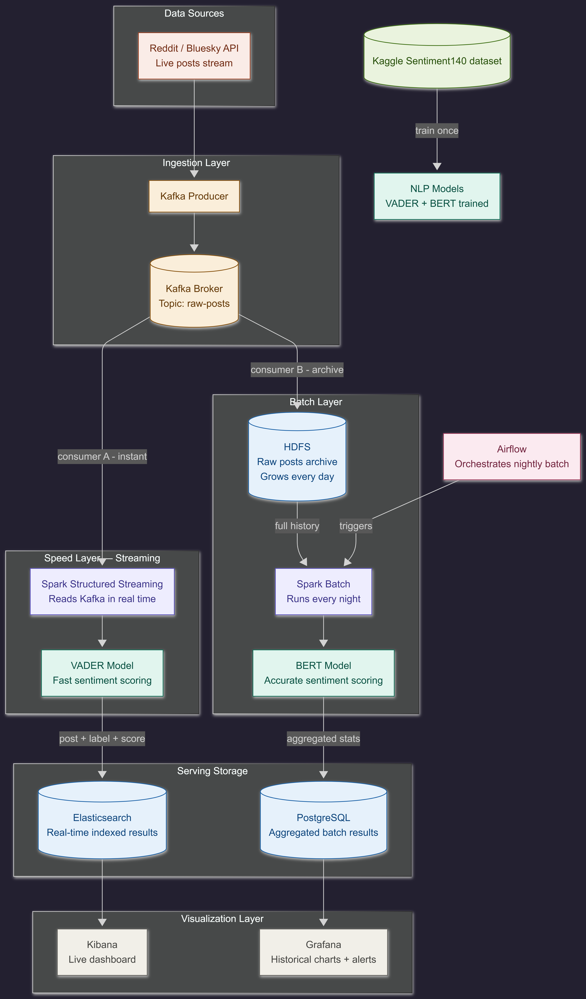

# 🌐 Social Sentiment Analysis — Big Data Streaming Pipeline

A real-time and historical sentiment analysis platform built on a **Lambda-style architecture**. The system streams live posts from Bluesky, processes them through a distributed pipeline, stores them in HDFS, and performs real-time analytics using Apache Spark Structured Streaming.

This repository now includes a dedicated batch recomputation layer (Lambda batch) that consumes only raw JSONL posts in HDFS, performs topic discovery, historical trend and anomaly detection, and event reconstruction, then writes processed datasets back to HDFS and indexes them into Elasticsearch for Grafana visualisation.

---

# 🚀 Overview

This project ingests a continuous stream of Bluesky posts, applies sentiment analysis (positive / negative / neutral), and stores results for two types of processing:

- ⚡ **Real-time analytics** → live sentiment tracking (seconds-level updates)
- 📊 **Historical analytics** → batch analysis of trends over time

It demonstrates a full end-to-end **Big Data streaming architecture**.

---

# 🧱 System Architecture

## High-level pipeline

```
Bluesky Stream
   ↓
WebSocket Bridge (Python)
   ↓
TCP Socket (port 9999)
   ↓
HDFS Collector (buffering + batching)
   ↓
HDFS Data Lake (partitioned storage)
   ↓
Apache Spark Structured Streaming
   ↓
Real-time analytics output
```

## 🗂️ Batch Outputs (examples)

`batch_topics` (one document per discovered topic):

```json
{
   "cluster_id": 12,
   "count": 234,
   "keywords": ["iphone", "leak", "apple event"],
   "sample_post_ids": ["p123", "p456"],
   "run_at": "2026-05-07T12:00:00Z"
}
```

`batch_trends` (keyword historical stats + bursts):

```json
{
   "keyword": "iphone",
   "mean": 12.3,
   "std": 5.1,
   "bursts": ["2026-05-05", "2026-05-06"],
   "history": [{"day": "2026-05-05", "count": 47}, {"day": "2026-05-06", "count": 58}]
}
```

`batch_events` (reconstructed event cluster):

```json
{
   "cluster_id": 12,
   "start": "2026-05-06T08:10:00Z",
   "end": "2026-05-06T09:30:00Z",
   "count": 342,
   "intensity": 18.49,
   "sample_ids": ["p987", "p654"]
}
```

---

## Architecture Diagram



---

# 📦 Components

## 🔵 1. Bluesky Bridge (`bridge.py`)
- Connects to Bluesky Jetstream WebSocket
- Filters `app.bsky.feed.post` events
- Extracts post text
- Streams JSON messages via TCP socket (port 9999)

---

## 🟡 2. HDFS Collector (`hdfs_collector.py`)
- Connects to bridge via TCP
- Buffers incoming posts
- Writes JSONL files to HDFS using WebHDFS API
- Organizes data by time partitions:

```
/bluesky/raw/YYYY-MM-DD/HH/
```

---

## 🟢 3. Hadoop Cluster (HDFS)
- NameNode + DataNodes
- Stores raw streaming data
- Web UI available at:
  - http://localhost:9870

### Batch processed outputs (HDFS)

The batch jobs write processed datasets to HDFS under `/bluesky/processed` partitioned by run timestamp and type:

```
/bluesky/processed/topics/YYYY-MM-DD/HH/batch_<ts>.jsonl
/bluesky/processed/trends/YYYY-MM-DD/HH/batch_<ts>.jsonl
/bluesky/processed/events/YYYY-MM-DD/HH/batch_<ts>.jsonl
```

Each file contains JSONL documents representing discovered topics, detected trends/anomalies, and reconstructed events respectively. For production workloads prefer Parquet for columnar storage and easier analytics.

---

## 🟣 4. Apache Spark Streaming
- Reads new files from HDFS
- Uses Structured Streaming API
- Performs real-time aggregation
- Outputs results to console

## 🔁 Batch Layer (Spark)

The batch layer is implemented as a Spark job (`batch-spark/batch_job.py`) and performs the following daily or weekly recomputations from raw HDFS data only (no streaming-derived summaries are required):

- Topic discovery: preprocess raw text, compute embeddings (`sentence-transformers`), cluster posts into dynamic topics, and extract representative keywords and sample posts per topic.
- Historical trend & anomaly detection: compute keyword/topic frequencies across time buckets, estimate long-term baselines (mean/std) and surface burst/baseline deviations.
- Event reconstruction: group temporally and semantically similar posts into event clusters with start/end times, counts and intensity scores.

Batch outputs are written back to HDFS (see paths above) and bulk-indexed into Elasticsearch indices:

- `batch_topics` — topic metadata, keywords and counts
- `batch_trends` — per-keyword/topic historical time series and detected bursts
- `batch_events` — reconstructed events with start/end and intensity

Grafana is provisioned to use Elasticsearch as a datasource and includes a sample dashboard `monitoring/grafana/dashboards/batch-analytics.json` that visualizes topic evolution, trend spikes, and event timelines.

---

# ⚙️ Tech Stack

- Python 3.11
- Docker & Docker Compose
- Apache Hadoop (HDFS)
- Apache Spark 3.5 (official image)
- WebSockets
- TCP Sockets
- WebHDFS REST API

---

# 📁 Project Structure

```
Social-Media-Sentiment-Analysis
├── bridge/
│   ├── Dockerfile
│   └── bridge.py
├── collector/
│   ├── Dockerfile
│   └── hdfs_collector.py
├── spark/
│   ├── Dockerfile
│   └── stream.py
├── hadoop-config/
│   ├── core-site.xml
│   └── hdfs-site.xml
├── docker-compose.yml
├── hadoop.env
└── README.md
```

---

# 🚀 How to Run

## 1. Clone repository

```bash
git clone <repo-url>
cd Social-Media-Sentiment-Analysis
```

---

## 2. Start full system

```bash
docker compose up --build
```

---

# 🌐 Access Interfaces

| Service        | URL |
|----------------|-----|
| HDFS NameNode  | http://localhost:9870 |
| Spark UI       | http://localhost:8080 |

---

# 📊 Expected Output

## 📦 HDFS Storage

Files stored in:

```
/bluesky/raw/YYYY-MM-DD/HH/posts_*.jsonl
```

Example content:

```json
{"text": "hello world"}
{"text": "iphone event live"}
```

---

## ⚡ Spark Streaming Output

Example console output:

```
-------------------------------------------
Batch: 0
-------------------------------------------
+--------------------+-----+
|text                |count|
+--------------------+-----+
|apple event         |12   |
|iphone leak         |7    |
+--------------------+-----+
```

---

# 🔄 Data Flow Summary

1. Bluesky streams live posts
2. Bridge forwards data via TCP
3. Collector buffers and batches data
4. Data is stored in HDFS (JSONL format)
5. Spark reads new files automatically
6. Real-time aggregation is computed

---

# 🧠 Key Features

- Real-time ingestion pipeline
- Distributed storage (HDFS)
- Streaming analytics (Spark)
- Fault-tolerant buffering system
- Time-based partitioning
- Fully containerized microservices architecture

---

# 🧪 Testing the System

## Check bridge logs

```bash
docker logs -f bluesky-bridge
```

---

## Check collector logs

```bash
docker logs -f hdfs-collector
```

---

## Check HDFS

http://localhost:9870

---

## Check Spark logs

```bash
docker logs -f spark-app
```

---

# 🛠️ Common Issues

## ❌ Bridge not reachable
- Ensure `BRIDGE_HOST=bluesky-bridge`
- Ensure port `9999` is exposed

---

## ❌ Spark crashes at startup
- Missing schema in `stream.py`
- Incorrect HDFS configuration

---

## ❌ No Spark output
- Spark only reads files created after it starts

---

# 📈 Future Improvements

- Replace TCP bridge with Kafka (production-grade streaming)
- Add sentiment analysis (NLP models)
- Build real-time dashboard (Streamlit / React)
- Convert JSONL → Parquet format
- Add windowed analytics (5–10 min trends)

---

# 👨‍💻 Author

This project demonstrates core Big Data concepts:

- Streaming data ingestion
- Distributed storage systems
- Real-time processing engines
- Containerized microservices architecture

---

# 📜 License

MIT